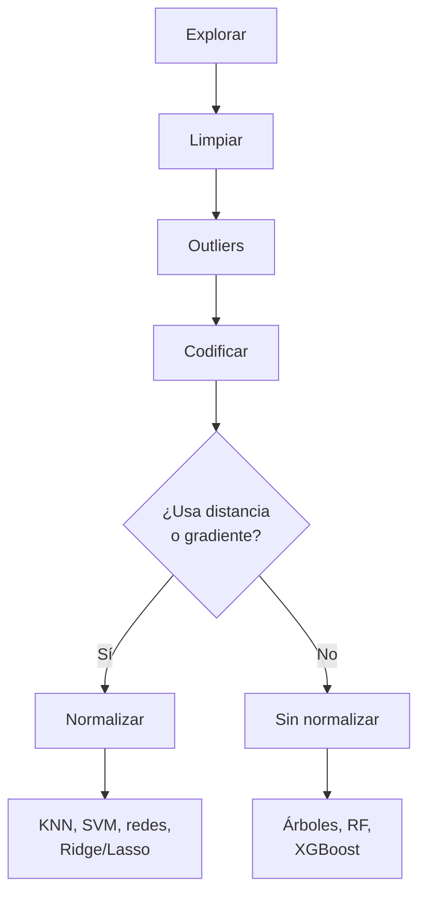

# Guía de limpieza y preprocesamiento de datos

Referencia técnica sobre las etapas de limpieza y preprocesamiento de datos en proyectos de Machine Learning, con foco en qué requiere cada familia de algoritmos.

## Índice

1. [Exploración inicial](#1-exploración-inicial)
2. [Manejo de nulos](#2-manejo-de-nulos)
3. [Duplicados](#3-duplicados)
4. [Corrección de tipos de datos](#4-corrección-de-tipos-de-datos)
5. [Outliers](#5-outliers)
6. [Codificación de variables categóricas](#6-codificación-de-variables-categóricas)
7. [Escalado y normalización](#7-escalado-y-normalización)
8. [Tabla maestra: requerimientos por algoritmo](#8-tabla-maestra-requerimientos-por-algoritmo)
9. [Orden del pipeline y data leakage](#9-orden-del-pipeline-y-data-leakage)

---

## Introducción

La limpieza y el preprocesamiento no son un checklist de pasos intercambiables: es un pipeline secuencial, donde el resultado de cada etapa condiciona la siguiente. Codificar categóricas antes de tratar los nulos de esas mismas columnas, o normalizar antes de separar train/test, produce resultados silenciosamente incorrectos — el código corre sin errores, pero el modelo aprende sobre datos distorsionados o filtrados.



Por qué importa este orden:

- **Explorar antes de limpiar**: no se puede decidir una estrategia de imputación o de tipos sin conocer primero el volumen y patrón de nulos, duplicados y tipos mal cargados.
- **Limpiar antes de tratar outliers**: un tipo de dato mal cargado (ej. un string en una columna numérica) puede generar outliers falsos que en realidad son errores de carga, no valores extremos reales.
- **Outliers antes de codificar**: la detección de outliers (IQR, z-score) solo tiene sentido sobre columnas numéricas; conviene resolverla antes de expandir el dataset con columnas dummy.
- **Codificar antes de decidir el escalado**: recién con el dataset totalmente numérico se puede evaluar qué algoritmo se va a usar y si ese algoritmo requiere normalización.
- **La decisión de normalizar depende del algoritmo, no del dataset**: por eso es el último paso y es condicional — no todos los pipelines la necesitan (ver [sección 7](#7-escalado-y-normalización) y la [tabla maestra](#8-tabla-maestra-requerimientos-por-algoritmo)).

El resto de esta guía desarrolla cada etapa en detalle, con el criterio técnico para decidir qué técnica aplicar y qué algoritmos son sensibles a cada tipo de problema en los datos.

---

## 1. Exploración inicial

Antes de limpiar nada, hay que entender la estructura y calidad del dataset.

```python
import pandas as pd
import numpy as np

df = pd.read_csv("dataset.csv")

df.info()                 # tipos de datos, nulos por columna, memoria
df.describe()             # estadísticas de columnas numéricas
df.describe(include="object")  # estadísticas de columnas categóricas
df.shape                  # (filas, columnas)
df.isna().sum()           # nulos por columna
df.duplicated().sum()     # cantidad de filas duplicadas
df.dtypes                 # tipo de cada columna
```

Esta etapa define qué transformaciones son necesarias en las siguientes. No se descarta ni modifica nada todavía.

---

## 2. Manejo de nulos

### Estrategias

| Estrategia | Cuándo usarla |
|---|---|
| `dropna()` | Pocos nulos (<5% de las filas) y no hay patrón sistemático en su ausencia |
| Imputación por media/mediana | Variable numérica, distribución sin demasiados outliers (media) o con ellos (mediana) |
| Imputación por moda | Variable categórica |
| Imputación por modelo (`KNNImputer`, `IterativeImputer`) | Nulos con relación a otras variables, dataset grande |
| Valor centinela (`"desconocido"`, `-1`) | Cuando la ausencia del dato es en sí misma información relevante |

```python
from sklearn.impute import SimpleImputer, KNNImputer

# Eliminar filas con nulos
df_clean = df.dropna()

# Imputación simple
imputer = SimpleImputer(strategy="median")
df["columna"] = imputer.fit_transform(df[["columna"]])

# Imputación basada en vecinos
knn_imputer = KNNImputer(n_neighbors=5)
df_num = pd.DataFrame(knn_imputer.fit_transform(df.select_dtypes(include=np.number)))
```

> `KNNImputer` calcula distancias entre observaciones para decidir qué vecinos usar, igual que `KNeighborsRegressor` o `KNeighborsClassifier`. Si las features numéricas están en escalas muy distintas, la imputación queda dominada por la de mayor magnitud. Idealmente debería aplicarse dentro del mismo `Pipeline`/`ColumnTransformer` que el escalado, no antes y de forma aislada (ver [sección 7](#7-escalado-y-normalización)).

### Qué algoritmos toleran nulos

- **No toleran nulos**: prácticamente todos los estimadores de scikit-learn (`LinearRegression`, `SVR`, `KNeighborsRegressor`, `RandomForestRegressor`, etc.) — hay que imputar o eliminar antes de `fit()`.
- **Toleran nulos nativamente**: `XGBoost`, `LightGBM`, `CatBoost` (los tres manejan `NaN` internamente, aprendiendo la mejor dirección de split para valores faltantes).

---

## 3. Duplicados

```python
df.duplicated().sum()          # cantidad de duplicados exactos
df[df.duplicated(keep=False)]  # ver todas las filas involucradas
df = df.drop_duplicates()      # eliminar, conserva la primera ocurrencia
df = df.drop_duplicates(subset=["id_cliente"])  # duplicados por clave específica
```

Los duplicados exactos inflan artificialmente el peso de esas observaciones durante el entrenamiento, sesgando el modelo hacia ellas. Es relevante especialmente en modelos sensibles a la distribución de frecuencias (Naive Bayes, KNN).

---

## 4. Corrección de tipos de datos

```python
df["fecha"] = pd.to_datetime(df["fecha"], format="%Y-%m-%d", errors="coerce")
df["precio"] = pd.to_numeric(df["precio"], errors="coerce")
df["categoria"] = df["categoria"].astype("category")

# Limpieza de strings antes de convertir
df["texto"] = df["texto"].str.strip().str.lower()
df["estado"] = df["estado"].replace({"si": "sí", "SI": "sí", "Sí ": "sí"})
```

`errors="coerce"` convierte los valores no parseables en `NaN` en lugar de lanzar una excepción — útil para detectar registros corruptos que después hay que tratar como nulos.

---

## 5. Outliers

### Detección

```python
# Método IQR
Q1 = df["columna"].quantile(0.25)
Q3 = df["columna"].quantile(0.75)
IQR = Q3 - Q1
limite_inf = Q1 - 1.5 * IQR
limite_sup = Q3 + 1.5 * IQR
outliers = df[(df["columna"] < limite_inf) | (df["columna"] > limite_sup)]

# Z-score
from scipy import stats
z_scores = np.abs(stats.zscore(df["columna"]))
outliers = df[z_scores > 3]
```

### Tratamiento

- **Eliminar**: si son errores de carga o mediciones inválidas.
- **Capear (winsorizing)**: reemplazar por el límite superior/inferior en vez de eliminar, cuando el dato es válido pero extremo.
- **Dejar sin modificar**: cuando el outlier representa un caso real de negocio (fraude, evento extremo) y es justamente lo que el modelo debe aprender a detectar.

### Sensibilidad por algoritmo

| Sensibles a outliers | Robustos a outliers |
|---|---|
| Regresión lineal (OLS) | Árboles de decisión |
| Regresión logística | Random Forest |
| KNN | Gradient Boosting / XGBoost |
| SVM | Modelos basados en mediana (`TheilSenRegressor`) |
| K-Means | `HuberRegressor`, `RANSACRegressor` (diseñados para ser robustos) |
| PCA | |

---

## 6. Codificación de variables categóricas

| Técnica | Cuándo usarla |
|---|---|
| `OrdinalEncoder` / mapeo manual | Variable ordinal (tiene orden: bajo/medio/alto) |
| `OneHotEncoder` / `pd.get_dummies()` | Variable nominal (sin orden: rojo/verde/azul) |
| `TargetEncoder` / mean encoding | Alta cardinalidad (muchas categorías), riesgo de overfitting si no se regulariza |
| Encoding nativo (CatBoost) | Alta cardinalidad, sin necesidad de transformación manual |

```python
from sklearn.preprocessing import OrdinalEncoder, OneHotEncoder

# Ordinal — el orden hay que declararlo explícitamente
encoder = OrdinalEncoder(categories=[["bajo", "medio", "alto"]])
df["nivel_encoded"] = encoder.fit_transform(df[["nivel"]])  # bajo=0, medio=1, alto=2

# Alternativa equivalente con mapeo manual
df["nivel_encoded"] = df["nivel"].map({"bajo": 0, "medio": 1, "alto": 2})

# Nominal
df_encoded = pd.get_dummies(df, columns=["color"], drop_first=True)  # drop_first evita el dummy trap
```

**`LabelEncoder` no es la herramienta correcta para variables ordinales**: asigna los códigos por orden alfabético de aparición, no por el orden semántico de las categorías. Con `["alto", "bajo", "medio"]` el resultado sería `alto=0, bajo=1, medio=2` — un orden que no respeta la escala real (bajo < medio < alto). `LabelEncoder` está pensado para codificar la variable *target* en clasificación, no features ordinales. Para features ordinales, `OrdinalEncoder` con `categories` explícito o un mapeo manual son las opciones correctas.

**Dummy trap**: al codificar con one-hot sin `drop_first=True`, una columna queda como combinación lineal perfecta de las demás, generando multicolinealidad en modelos lineales.

### Qué algoritmos necesitan encoding

- **Requieren encoding numérico**: todos los estimadores de scikit-learn — no aceptan strings directamente.
- **Manejan categóricas nativamente**: `CatBoost` (su feature distintiva), y `LightGBM`/`XGBoost` con soporte parcial habilitando el flag correspondiente (`enable_categorical=True` en XGBoost reciente).

---

## 7. Escalado y normalización

| Scaler | Fórmula | Cuándo usarlo |
|---|---|---|
| `MinMaxScaler` | `(x - min) / (max - min)` | Rango acotado conocido, sin outliers extremos |
| `StandardScaler` | `(x - media) / desvío` | Caso general, asume distribución cercana a normal |
| `RobustScaler` | `(x - mediana) / IQR` | Dataset con outliers ya identificados y no eliminados |

```python
from sklearn.preprocessing import StandardScaler

scaler = StandardScaler()
X_train_scaled = scaler.fit_transform(X_train)  # fit + transform SOLO en train
X_test_scaled = scaler.transform(X_test)        # transform (sin fit) en test
```

### Qué algoritmos requieren escalado

**Necesario** (el algoritmo lo requiere estructuralmente):
- KNN, SVM, K-Means — calculan distancias entre puntos, features en distinta escala distorsionan el resultado
- Regresión logística, redes neuronales — el gradiente converge mejor con features en rango similar
- Regresión con regularización (Ridge, Lasso, ElasticNet) — la penalización afecta por igual a todos los coeficientes, así que una feature en escala grande queda injustamente menos penalizada que una en escala chica
- PCA — la varianza explicada depende directamente de la escala

**Recomendado, no obligatorio**:
- Regresión lineal (OLS) sin regularización — matemáticamente converge a la misma solución esté o no escalado (los coeficientes se reescalan proporcionalmente); escalar ayuda a la estabilidad numérica y a comparar la magnitud de los coeficientes entre sí, pero no es un requisito del método

**No requieren escalado** (basados en particiones/reglas):
- Árboles de decisión, Random Forest, Gradient Boosting, XGBoost, LightGBM, CatBoost — dividen el espacio por umbrales en cada feature de forma independiente, la escala relativa entre columnas no afecta el resultado

---

## 8. Tabla maestra: requerimientos por algoritmo

| Algoritmo | Nulos | Outliers | Encoding | Escalado |
|---|:---:|:---:|:---:|:---:|
| Regresión lineal (OLS) | ❌ | Sensible | Necesario | Recomendado |
| Ridge / Lasso / ElasticNet | ❌ | Sensible | Necesario | Necesario |
| Regresión logística | ❌ | Sensible | Necesario | Necesario |
| KNN | ❌ | Sensible | Necesario | Necesario |
| SVM / SVR | ❌ | Sensible | Necesario | Necesario |
| K-Means | ❌ | Sensible | Necesario | Necesario |
| PCA | ❌ | Sensible | Necesario | Necesario |
| Árbol de decisión | ❌ | Robusto | Necesario | No necesario |
| Random Forest | ❌ | Robusto | Necesario | No necesario |
| Gradient Boosting (sklearn) | ❌ | Robusto | Necesario | No necesario |
| XGBoost | ✅ tolera | Robusto | Parcial (`enable_categorical`) | No necesario |
| LightGBM | ✅ tolera | Robusto | Parcial (nativo con flag) | No necesario |
| CatBoost | ✅ tolera | Robusto | ✅ nativo | No necesario |
| Redes neuronales (MLP) | ❌ | Sensible | Necesario | Necesario |

❌ = no tolera, requiere tratamiento previo · ✅ = maneja nativamente

---

## 9. Orden del pipeline y data leakage

Orden recomendado:

```
Explorar → Limpiar (nulos, duplicados, tipos, texto) → Outliers → Codificar → Split (train/test) → Escalar
```

El punto crítico es que el **split va antes del escalado**, no después. El `Scaler` (o cualquier imputer/encoder que aprenda parámetros de los datos) debe hacer `fit()` únicamente sobre `X_train`, y luego `transform()` sobre `X_test` con esos mismos parámetros:

```python
from sklearn.model_selection import train_test_split
from sklearn.preprocessing import StandardScaler

X_train, X_test, y_train, y_test = train_test_split(X, y, test_size=0.2, random_state=42)

scaler = StandardScaler()
X_train_scaled = scaler.fit_transform(X_train)  # aprende media y desvío solo de train
X_test_scaled = scaler.transform(X_test)         # aplica esos mismos parámetros a test
```

Si se hace `fit_transform()` sobre el dataset completo antes del split, la media y el desvío calculados incluyen información de `test`, lo que constituye **data leakage**: el modelo evalúa su performance sobre datos que ya influyeron en su preprocesamiento, dando una métrica optimista que no se replica en producción. El mismo criterio aplica a imputadores (`SimpleImputer`, `KNNImputer`) y a encoders que aprenden de la distribución de los datos (`TargetEncoder`).
